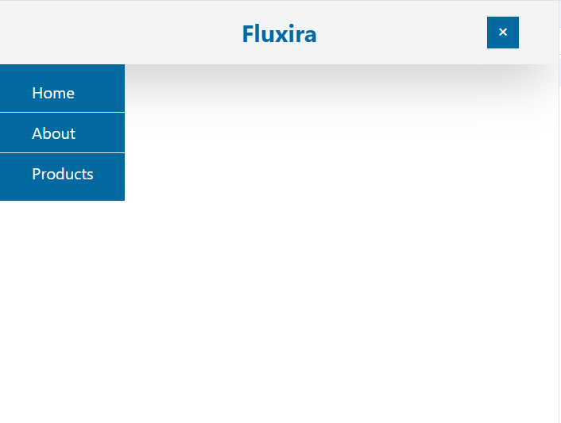

# 🌐 Responsive Navbar

A **simple and elegant** responsive navigation bar built using **HTML**, **Tailwind CSS**, and **JavaScript**.  
Perfect for modern websites, this navbar adapts beautifully between desktop and mobile views.

---

## 🚀 Tech Stack

### 🔷 Frontend Development

---

## 📱 Responsive Features

- 🖥️ Desktop view: horizontal navbar  
- 📱 Mobile view: hamburger icon with dropdown  
- 🎯 Easy customization via Tailwind classes

---

## 📸 Preview

> *(You can include a screenshot or gif here)*  
> 

---

## ⚙️ How to Use

1. Clone or download this repo
2. Open `index0.html` in your browser
3. Customize the content or Tailwind classes as needed

---

## 📝 License

This project is **open-source** and free to use for personal or educational projects.

---

### 💡 Created with 💖 using Tailwind CSS & JavaScript
